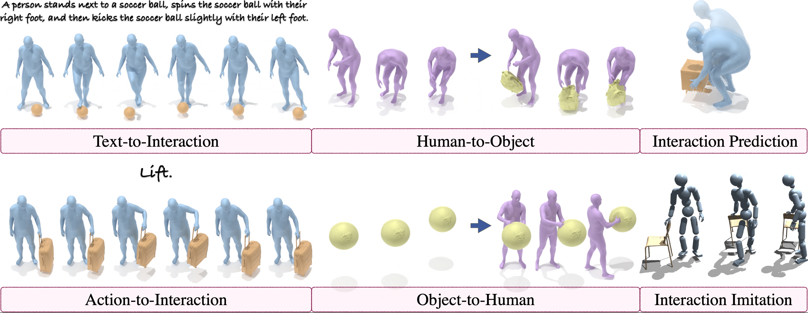

<p align="center">
<h1><strong>InterAct: Advancing Large-Scale Versatile 3D Human-Object Interaction Generation</strong></h1>
  <p align="center">
    <a href='https://sirui-xu.github.io' target='_blank'>Sirui Xu</a><sup>*</sup>&emsp;
    <a href='' target='_blank'>Dongting Li</a><sup>*</sup>&emsp;
    <a href='' target='_blank'>Yucheng Zhang</a><sup>*</sup>&emsp;
    <a href='' target='_blank'>Xiyan Xu</a><sup>*</sup>&emsp;
    <a href='' target='_blank'>Qi Long</a><sup>*</sup>&emsp;
    <a href='https://github.com/wzyabcas' target='_blank'>Ziyin Wang</a><sup>*</sup>&emsp;
    <a href='' target='_blank'>Yunzhi Lu</a>&emsp;
    <a href='' target='_blank'>Shuchang Dong</a>&emsp;
    <a href='' target='_blank'>Hezi Jiang</a>&emsp;
    <a href='' target='_blank'>Akshat Gupta</a>&emsp;
    <a href='https://yxw.web.illinois.edu/' target='_blank'>Yu-Xiong Wang</a>&emsp;
    <a href='https://lgui.web.illinois.edu/' target='_blank'>Liang-Yan Gui</a>&emsp;
    <br>
    University of Illinois Urbana Champaign
    <br>
    <sup>*</sup>Equal contribution
    <br>
    <strong>CVPR 2025</strong>
  </p>
</p>

</p>
<p align="center">
  <a href='https://arxiv.org/pdf/2509.09555'>
    </a>
  <!-- <a href='https://arxiv.org/pdf/xxxx.xxxxx.pdf'>
    </a> -->
<a href='https://sirui-xu.github.io/InterAct'>
    </a> 
  <a href='https://github.com/wzyabcas/InterAct'>
    </a>
</p>




## News
- [2025-04-20] Initial release of the InterAct dataset
- [2025-07-08] Release the proessing code for unified SMPL-H representation
- [2025-09-12] Publish the paper on arXiv
- [2025-10-06] Release the hoi correction pipeline
- [2025-10-06] Release the evaluation pipeline for text-to-hoi
- [2025-10-29] Release corrected OMOMO data.
- [2025-11-23] Provide additional supports on ARCTIC and ParaHome.
- [2025-11-26] Release training code, pretrained model and evaluator checkpoints.
- [2025-11-26] Release augmentated data for InterAct-X. 
- [2025-12-07] 🚀 Release the data conversion pipeline for bringing InterAct into simulation, specifically for [InterMimic](https://github.com/Sirui-Xu/InterMimic) use.

## TODO
- [x] Release comprehensive text descriptions, data processing workflows, visualization tools, and usage guidelines
- [x] Release the proessing code for unified SMPL-H representation
- [x] Publish the paper on arXiv
- [x] Release the evaluation pipeline for the benchmark
- [x] Release HOI correction pipeline
- [x] Release HOI correction data
- [x] Release augmentation data 
- [x] Release baseline constructions for text2HOI. 
- [x] Release the pipeline for constructing simulation ready data 
- [ ] Release baseline constructions for the other HOI generative tasks
- [ ] Release the dataset with unified SMPL representation
- [ ] Release retargeted HOI dataset with unified human shape


## General Description

We introduce InterAct, a comprehensive large-scale 3D human-object interaction (HOI) dataset, originally comprising 21.81 hours of HOI data consolidated from diverse sources, the dataset is meticulously refined by correcting contact artifacts and augmented with varied motion patterns to extend the total duration to approximately 30 hours. It includes 34.1K sequence-level detailed text descriptions.

## Dataset Preparation

The InterAct dataset is consolidated according to the licenses of its original data sources. For data approved for redistribution, direct download links are provided; for others, we supply processing code to convert the raw data into our standardized format.

Please follow the steps below to download, process, and organize the data.

### 1. Request authorization

Please fill out [this form](https://docs.google.com/forms/d/e/1FAIpQLScMCfdd8BXzDBZ3iw0x5zA3KSTlD1F2GTaO8ylDG9Cj1upaPw/viewform?usp=sharing) to request non-commercial access to InterAct and InterAct-X. Once authorized, you'll receive the download links. Organize the data from neuraldome, imhd, and chairs according to the following directory structure.

<details>
  <summary>Data structure</summary>

```
data
│── neuraldome
│   ├── objects
│   │   └── baseball
│   │       ├── baseball.obj             # object mesh
│   │       └── sample_points.npy        # sampled object pointcloud
│   		└── ...
│   ├── objects_bps
│   │   └── baseball
│   │       └── baseball.npy             # static bps representation
│   	└── ...
│   ├── sequences
│   │   └── subject01_baseball_0
│   │       ├── action.npy 
│   │       ├── action.txt
│   │       ├── human.npz
│   │       ├── markers.npy
│   │		    ├── joints.npy
│   │		    ├── motion.npy
│   │       ├── object.npz
│   │       └── text.txt
│   	└── ...
│   └── sequences_canonical
│       └── subject01_baseball_0
│           ├── action.npy
│           ├── action.txt
│           ├── human.npz
│           ├── markers.npy
│           ├── joints.npy
│           ├── motion.npy
│           ├── object.npz
│           └── text.txt
│   	└── ...
│── imhd
│── chairs
└── annotations
```
</details>


### 2. Process from scratch  

The **GRAB**, **BEHAVE**, **INTERCAP**, **ARCTIC** and **ParaHome** datasets are available for academic research under custom licenses from the Max Planck Institute for Intelligent Systems. Note that we do not distribute the original motion data—instead, we provide the text labels annotated by our team. To download these datasets, please visit their respective websites and agree to the terms of their licenses:

<details>
  <summary>Licenses</summary>

- **GRAB:** [License](https://grab.is.tuebingen.mpg.de/license.html)
- **BEHAVE:** [License](https://virtualhumans.mpi-inf.mpg.de/behave/license.html)
- **INTERCAP:** [License](https://intercap.is.tue.mpg.de/license.html)
- **ARCTIC:** [License](https://github.com/zc-alexfan/arctic/blob/master/LICENSE)
- **ParaHome:** [License](https://github.com/snuvclab/ParaHome?tab=readme-ov-file#license)

</details>

<details>
  <summary>Please follow these steps to get started</summary>


1. Download SMPL+H, SMPLX, DMPLs.

    Download SMPL+H mode from [SMPL+H](https://mano.is.tue.mpg.de/download.php) (choose Extended SMPL+H model used in the AMASS project), DMPL model from [DMPL](https://smpl.is.tue.mpg.de/download.php) (choose DMPLs compatible with SMPL), and SMPL-X model from [SMPL-X](https://smpl-x.is.tue.mpg.de/download.php). Then, please place all the models under `./models/`. The `./models/` folder tree should be:

    ```
    models
    │── smplh
    │   ├── female
    │   │   ├── model.npz
    │   ├── male
    │   │   ├── model.npz
    │   ├── neutral
    │   │   ├── model.npz
    │   ├── SMPLH_FEMALE.pkl
    │   ├── SMPLH_MALE.pkl
    │   └── SMPLH_NEUTRAL.pkl    
    └── smplx
        ├── SMPLX_FEMALE.npz
        ├── SMPLX_FEMALE.pkl
        ├── SMPLX_MALE.npz
        ├── SMPLX_MALE.pkl
        ├── SMPLX_NEUTRAL.npz
        └── SMPLX_NEUTRAL.pkl
    ```

    Please follow [smplx tools](https://github.com/vchoutas/smplx/blob/main/tools/README.md#merging-smpl-h-and-mano-parameters) to merge SMPL-H and MANO parameters.

2. Prepare Environment

  - Create and activate a fresh environment:
    ```bash
    conda create -n interact python=3.8
    conda activate interact
    pip install torch==2.0.0 torchvision==0.15.1 torchaudio==2.0.1 --index-url https://download.pytorch.org/whl/cu118
    ```

    To install PyTorch3D, please follow the official instructions: [Pytorch3D](https://github.com/facebookresearch/pytorch3d/blob/main/INSTALL.md).

    Install remaining packages:
    ```
    pip install -r requirements.txt
    python -m spacy download en_core_web_sm
    ```

3. Prepare raw data

  - **BEHAVE** 

    Download the motion data from [this link](https://datasets.d2.mpi-inf.mpg.de/cvpr22behave/behave-30fps-params-v1.tar), and put them into [./data/behave/sequences](data/behave/sequences/). Download object data from [this link](https://datasets.d2.mpi-inf.mpg.de/cvpr22behave/objects.zip), and put them into [./data/behave/objects](data/behave/objects/). 

    Expected File Structure:

    ```bash
    data/behave/
    ├── sequences
    │   ├── data_name
    │       ├── object_fit_all.npz        # object's pose sequences
    │       └── smpl_fit_all.npz          # human's pose sequences
    └── objects
        └── object_name
            ├── object_name.jpg       # one photo of the object
            ├── object_name.obj       # reconstructed 3D scan of the object
            ├── object_name.obj.mtl   # mesh material property
            ├── object_name_tex.jpg   # mesh texture
            └── object_name_fxxx.ply  # simplified object mesh 
    ```

  - **OMOMO**

    Download the dataset from this [link](https://github.com/lijiaman/omomo_release), and download the text annotations from this [link](https://github.com/lijiaman/omomo_release/blob/main/omomo_text_anno.zip).

    Expected File Structure:
    ```bash
    data/omomo/raw
    ├── omomo_text_anno_json_data              # Annotation JSON data
    ├── captured_objects 
    │   └── object_name_cleaned_simplified.obj # Simplified object mesh
    ├── test_diffusion_manip_seq_joints24.p	   # Test sequences
    └── train_diffusion_manip_seq_joints24.p   # Train sequences
    ```
    
  - **InterCap**

    Dowload InterCap from the [the project website](https://intercap.is.tue.mpg.de/). Please download the one with "new results via newly trained LEMO hand models"

    Expected File Structure:

    ```bash
    data/intercap/raw
    └── 01
        └── 01
            └── Seg_id
                ├── res.pkl					   # Human and Object Motion 				
                └── Mesh
                    └── 00000_second_obj.ply   # Object mesh 
      ...
    ```

  - **GRAB**

    Download GRAB from [the project website](https://grab.is.tue.mpg.de/). 

    Expected File Structure:
    ```bash
    data/grab/raw
    ├── grab
    │   ├── s1
    │       └── seq_name.npz      # Human and Object Motion 
        ...
    └── tools
        ├── object_meshes         # Object mesh
        ├── object_settings       
        ├── subject_meshes        # Subject mesh
        └── subject_settings	  
    ```

  - **ParaHome**

    Download ParaHome from [the project website](https://github.com/snuvclab/ParaHome)

    Expected File Structure:
    ```bash
    data/parahome/raw
    ├── seq
    │   ├── s1
    │       ├── text_annotations.json
    │       ├── object_transformations.pkl
    │       ├── object_in_scene.json
    │       ├── joint_states.pkl
    │       ├── joint_positions.pkl
    │       ├── head_tips.pkl
    │       ├── hand_joint_orientations.pkl
    │       ├── bone_vectors.pkl
    │       ├── body_joint_orientations.pkl
    │       └── body_global_transform.pkl
        ...
    ├── scan
    │   ├── book
    │       └── simplified
    │          └── base.obj
        ...
    └── smplx_seq
        ├── s1
            ├── smplx_params.pkl
            └── smplx_pose.pkl
        ...
    ```
  - **ARCTIC**

    Download raw sequences, and meta files from [the project website](https://github.com/zc-alexfan/arctic/blob/master/docs/data/README.md)
  
    Download text annotations from [this project website](https://github.com/JunukCha/Text2HOI?tab=readme-ov-file)
  
    Expected File Structure:
    ```bash
    data/arctic
    ├── description   
    │   ├── s01
    │       ├── box_grab_01
    │           └── description.txt
            ...
        ...
    └── raw
        ├── meta
        │   ├── object_vtemplates
        │       ├── box
        │           ├── bottom_keypoints_300.json
        │           ├── bottom.obj
                    ...
        │           ├── mesh.obj
                    ...
        │           ├── parts.json
        │           ├── top_keypoints_300.json
        │           └── top.obj
                ...
        │   ├── subject_vtemplates
        │       ├── s01.obj
                ...
        │       └── s10.obj
            ...
        └── raw_seqs
            ├── s01
                ├── box_grab_01.smplx.npy
                ...
            ...
        
    ```

4. Data Processing

    After organizing the raw data, execute the following steps to process the datasets into our standard representations.

  -  
    Run the processing scripts for each dataset:

    ```bash
    python process/process_behave.py
    python process/process_grab.py
    python process/process_intercap.py
    python process/process_omomo.py
    python process/process_parahome.py
    python process/process_arctic.py
    ```

  - Canonicalize the object mesh:
    
    ```
    python process/canonicalize_obj.py
    ```
    
  - Segment the sequences according to annotations and generate associated text files:
    
    ```bash
    python process/process_text.py
    python process/process_text_omomo.py
    ```
    
    After processing, the directory structure under [data/](data/) should include all sub-datasets, including:
    
    ```
    data
    ├── annotation
    ├── behave
    │   ├── objects
    │   │   └── object_name
    │   │       └── object_name.obj
    │   └── sequences
    │       └── id
    │           ├── human.npz
    │           ├── object.npz
    │           └── text.txt
    ├── omomo
    │   ├── objects
    │   │   └── object_name
    │   │       └── object_name.obj
    │   └── sequences
    │       └── id
    │           ├── human.npz
    │           ├── object.npz
    │           └── text.txt
    ├── intercap
    │   ├── objects
    │   │   └── object_name
    │   │       └── object_name.obj
    │   └── sequences
    │       └── id
    │           ├── human.npz
    │           ├── object.npz
    │           └── text.txt
    ├── grab
    │   ├── objects
    │   │   └── object_name
    │   │       └── object_name.obj
    │   └── sequences
    │       └── id
    │           ├── human.npz
    │           ├── object.npz
    │           └── text.txt
    ├── parahome
    │   ├── objects
    │   │   └── object_name
    │   │       └── base.obj
    │   └── sequences
    │       └── id
    │           ├── human.npz
    │           └── object_{object_name}_{part}.npz
    ├── arctic
        ├── objects
        │   └── object_name
        │       └── base.obj
        └── sequences
            └── id
                ├── human.npz
                └── object.npz
    
    ```
    
- Canonicalize the human data by running:

  ```bash
  python process/canonicalize_human.py
  
  # or multi_thread for speedup
  python process/canonicalize_human_multi_thread.py
  ```

- Sample object keypoints:

  ```bash
  python process/sample_obj.py
  ```

- Extract motion representations:

  ```bash
  python process/motion_representation.py  
  ```

- Process the object bps for training:

  ```bash
  python process/process_bps.py
  ```

</details> 


<details>
  <summary>Optional: HOI Correction</summary>

  - To get the corrected OMOMO, please fill out [this form](https://docs.google.com/forms/d/e/1FAIpQLScMCfdd8BXzDBZ3iw0x5zA3KSTlD1F2GTaO8ylDG9Cj1upaPw/viewform?usp=sharing) to request non-commercial access, or process from scratch following the scripts below. 

  - Step1: Correct the full-body hoi by:

    ```bash
    python ./hoi_correction/optimize_fullbody.py --dataset behave
    python ./hoi_correction/optimize_fullbody_intercap.py --dataset intercap
    ```

  - Step2: Correct the wrist by:

    ```bash
    python ./hoi_correction/scan_diff.py --dataset omomo
    python ./hoi_correction/correct_wrist.py --dataset omomo
    ```
    The corrected sequences can be downloaded through this [link](https://drive.google.com/file/d/1HppMTRAHr24aIACYSeMCEFAf9Ou-LG5_/view?usp=sharing)

  - Step3: Correct the hand by:

    ```bash
    python ./hoi_correction/optimize.py --dataset omomo
    python ./hoi_correction/optimize_hand_behave.py --dataset behave
    ```


</details>


<details>
  <summary>Optional: Unify the motion to SMPL-H</summary>

  - Data

    Register on the [SMPL-X website](http://smpl-x.is.tue.mpg.de/), go to the
    downloads section to get the correspondences and sample data,
    by clicking on the *Model correspondences* button.
    Create a folder
    named `transfer_data` and extract the downloaded zip there. You should have the
    following folder structure now:

    ```bash
    process/smpl_conversion/transfer_data
    ├── meshes
    │   ├── smpl
    │   ├── smplx
    ├── smpl2smplh_def_transfer.pkl
    ├── smpl2smplx_deftrafo_setup.pkl
    ├── smplh2smpl_def_transfer.pkl
    ├── smplh2smplx_deftrafo_setup.pkl
    ├── smplx2smpl_deftrafo_setup.pkl
    ├── smplx2smplh_deftrafo_setup.pkl
    ├── smplx_mask_ids.npy
    ```

  - Unify the SMPL representation by:

    ```bash
    cd ./process/smpl_conversion
    python -m transfer_model --exp-cfg config_files/smplx2smplh.yaml --dataset grab
    ```

    `--dataset`: dataset in [grab, omomo, chairs, intercap]
    
    We adapt the smpl conversion code from [https://github.com/vchoutas/smplx.git](https://github.com/vchoutas/smplx.git) , special thanks to them!

</details>

## Data Loading 

To load and explore our data, please refer to the [demo notebook](data_demo.ipynb).

## 🔥 Data for Simulation

This pipeline depends on the requirements listed in the [InterMimic project](https://github.com/Sirui-Xu/InterMimic?tab=readme-ov-file#dependencies). Please make sure all dependencies are installed before running the script.

After completing the *data preparation* steps above, run the following to generate the simulation assets:

```bash
cd simulation
python interact2mimic.py --dataset_name [dataset]
```

After processing, the generated files will be organized as follows:

* **Motion files** (`.pt`) are stored in
  `simulation/intermimic/InterAct/{dataset}`

* **SMPL humanoid files** (`.xml`) are stored in
  `simulation/intermimic/data/assets/{model_type}`

* **Object files** (`.urdf`) are stored in
  `simulation/intermimic/data/assets/objects/{dataset}`

For details on data loading, replaying, and training with the processed data, please refer to the [InterMimic repository](https://github.com/Sirui-Xu/InterMimic). We adapt the conversion code from [PHC](https://github.com/ZhengyiLuo/PHC), special thanks to them!

## Text2Interaction


<details>
   <summary>Prepare</summary>

  Download pretrained model and evaluator models:

  -  Download the checkpoints of the pretrained evaluator and text encoder used in training from this [link](https://drive.google.com/file/d/1-bpafRyaVHdX4TsltDHiGIxcjw-k1Fnf/view?usp=sharing), and put in `./text2interaction/assets/eval`.

  -  Optional: Download the pretrained model checkpoints from this [link](https://drive.google.com/file/d/1vfskohWxr7gBuve1MLD1RlGut_xSN8mL/view?usp=sharing), and put in `./text2interaction/save/`.
  
  </details>

<details>
   <summary>Training</summary>

  To train on our benchmark, execute the following steps:

  ```
  cd text2interaction
  python -m train.hoi_diff --save_dir ./save/t2m_interact --dataset interact
  ```
  
  </details>

  <details>
  <summary>Evaluation</summary>

  To evaluate on our benchmark, execute the following steps

  - Evaluate on the marker representation:

    ```
    python -m eval.eval_marker_representation \
    --model_path MODEL_PATH \
    --batch_size 64 \
    --dataset interact 
    ```
  - Evaluate on the marker representation with contact guidance used:

    ```
    python -m eval.eval_marker_representation_guide \
    --model_path MODEL_PATH \
    --batch_size 64 \
    --dataset interact 
    ```
    </details>


## Visualization

To visualize the dataset, execute the following steps:

1. Run the visualization script:

    ```bash
    python visualization/visualize.py [dataset_name]
    ```

    Replace [dataset_name] with one of the following: behave, neuraldome, intercap, omomo, grab, imhd, chairs.

2. To visualize markers, run:

    ```bash
    python visualization/visualize_markers.py
    ```


## Citation  

If you find this repository useful for your work, please cite:

```bibtex
@inproceedings{xu2025interact,
    title     = {{InterAct}: Advancing Large-Scale Versatile 3D Human-Object Interaction Generation},
    author    = {Xu, Sirui and Li, Dongting and Zhang, Yucheng and Xu, Xiyan and Long, Qi and Wang, Ziyin and Lu, Yunzhi and Dong, Shuchang and Jiang, Hezi and Gupta, Akshat and Wang, Yu-Xiong and Gui, Liang-Yan},
    booktitle = {CVPR},
    year      = {2025},
}
```

Please also consider citing the specific sub-dataset you used from **InterAct** as follows:
```bibtex
@inproceedings{taheri2020grab,
    title     = {{GRAB}: A Dataset of Whole-Body Human Grasping of Objects},
    author    = {Taheri, Omid and Ghorbani, Nima and Black, Michael J. and Tzionas, Dimitrios},
    booktitle = {ECCV},
    year      = {2020},
}

@inproceedings{brahmbhatt2019contactdb,
    title     = {{ContactDB}: Analyzing and Predicting Grasp Contact via Thermal Imaging},
    author    = {Brahmbhatt, Samarth and Ham, Cusuh and Kemp, Charles C. and Hays, James},
    booktitle = {CVPR},
    year      = {2019},
}

@inproceedings{bhatnagar2022behave,
    title     = {{BEHAVE}: Dataset and Method for Tracking Human Object Interactions},
    author    = {Bhatnagar, Bharat Lal and Xie, Xianghui and Petrov, Ilya and Sminchisescu, Cristian and Theobalt, Christian and Pons-Moll, Gerard},
    booktitle = {CVPR},
    year      = {2022},
}

@article{huang2024intercap, 
    title     = {{InterCap}: Joint Markerless {3D} Tracking of Humans and Objects in Interaction from Multi-view {RGB-D} Images}, 
    author    = {Huang, Yinghao and Taheri, Omid and Black, Michael J. and Tzionas, Dimitrios}, 
    journal   = {IJCV}, 
    year      = {2024}
}

@inproceedings{huang2022intercap,
    title     = {{InterCap}: {J}oint Markerless {3D} Tracking of Humans and Objects in Interaction},
    author    = {Huang, Yinghao and Taheri, Omid and Black, Michael J. and Tzionas, Dimitrios},
    booktitle = {GCPR},
    year      = {2022}, 
}

@inproceedings{jiang2023full,
    title     = {Full-body articulated human-object interaction},
    author    = {Jiang, Nan and Liu, Tengyu and Cao, Zhexuan and Cui, Jieming and Zhang, Zhiyuan and Chen, Yixin and Wang, He and Zhu, Yixin and Huang, Siyuan},
    booktitle = {ICCV},
    year      = {2023}
}

@inproceedings{zhang2023neuraldome,
    title     = {{NeuralDome}: A Neural Modeling Pipeline on Multi-View Human-Object Interactions},
    author    = {Juze Zhang and Haimin Luo and Hongdi Yang and Xinru Xu and Qianyang Wu and Ye Shi and Jingyi Yu and Lan Xu and Jingya Wang},
    booktitle = {CVPR},
    year      = {2023},
}

@article{li2023object,
    title     = {Object Motion Guided Human Motion Synthesis},
    author    = {Li, Jiaman and Wu, Jiajun and Liu, C Karen},
    journal   = {ACM Trans. Graph.},
    year      = {2023}
}

@inproceedings{zhao2024imhoi,
    author    = {Zhao, Chengfeng and Zhang, Juze and Du, Jiashen and Shan, Ziwei and Wang, Junye and Yu, Jingyi and Wang, Jingya and Xu, Lan},
    title     = {{I'M HOI}: Inertia-aware Monocular Capture of 3D Human-Object Interactions},
    booktitle = {CVPR},
    year      = {2024},
}

@inproceedings{kim2025parahome,
    title     = {Parahome: Parameterizing everyday home activities towards 3d generative modeling of human-object interactions},
    author    = {Kim, Jeonghwan and Kim, Jisoo and Na, Jeonghyeon and Joo, Hanbyul},
    booktitle = {CVPR},
    year      = {2025}
}

@inproceedings{fan2023arctic,
    title     = {{ARCTIC}: A Dataset for Dexterous Bimanual Hand-Object Manipulation},
    author    = {Fan, Zicong and Taheri, Omid and Tzionas, Dimitrios and Kocabas, Muhammed and Kaufmann, Manuel and Black, Michael J. and Hilliges, Otmar},
    booktitle = {CVPR},
    year      = {2023}
}

```
